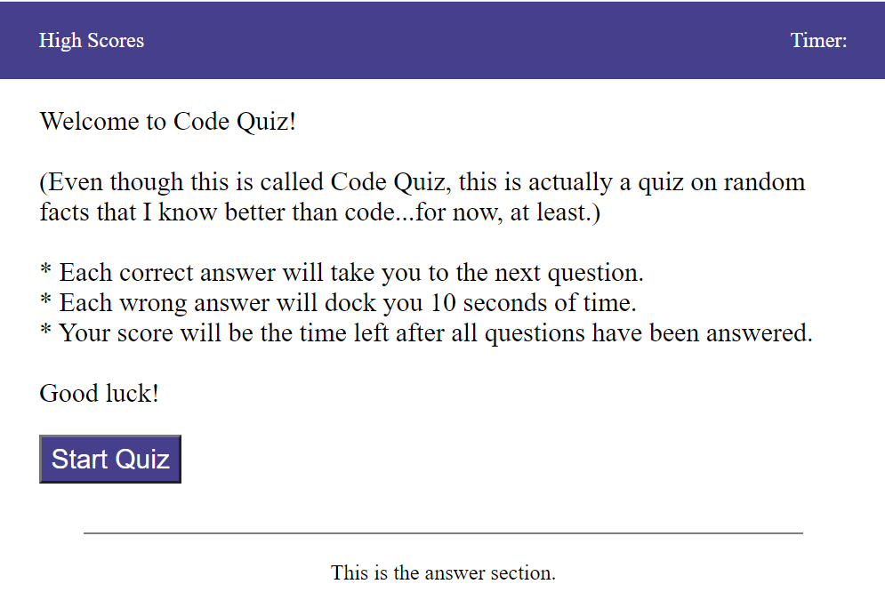

# Week 4 Challenge - Code Quiz

## Table of Contents

* [Deployment](#deploy)
* [Description of Challenge](#description)
* [Execution of the Challenge](#execution)
* [Lessons Learned](#lessons)
* [More A-ha in the Future, aka Challenges to Get Over](#challenges)

## Deployment 

* The challenge is deployed at the following live URL:
https://plainjane99.github.io/Code_Quiz/

You should see the following:

* The application code for this challenge is located at the following GitHub repository:
https://github.com/plainjane99/Code_Quiz

## Description of Challenge 

The Week 4 Challenge for the UCLA Extension Full Stack Development Bootcamp was to create a "Code Quiz" that a user could interact with by answering multiple-choice questions through clicking buttons.  No starter code was provided which means students were required to create the html, css, and javascript from scratch. The acceptance criteria included:  
* The quiz was to start with an instructional screen with a start button.  The user was to click the start button to activate the quiz application.
* The questions were to be multiple choice.
* The quiz was to be scored with a timer counting down.  Correct answers would allow the user to proceed to the next question.  Incorrect answers would decrease the timer and move on to the next question as long as the timer did not reach zero.
* The quiz was to have the ability to save user scores.

Once the acceptance criteria were met, the challenge was to be deployed to a live URL through GitHub and to have the webpage load with no errors.  

## Execution of the Challenge 

I found this challenge to be a lot of fun until I got completely stuck.  There is some basic understanding that I missing (possibly about EventListener) that prevented me from overcoming the hurdle in finishing my code.  Since the code is incomplete, I would like to present a walk-through of what was completed and what I would have done for the remainder of the criteria that I did not meet:

* Start Screen:  The screen that is visible upon opening the webpage shows a start screen that welcomes the user and introduces the quiz.  The Start Screen message and button was created with dynamically created HTML.  The "Start Quiz" button can be pressed to move on to the first question.  This interaction was created through the EventListener method.

* First Question:  The next screen that is visible once the "Start Quiz" button is pressed is the first question.  The first question was also created with dynamically created HTML.  Each button can be depressed and the answer is logged.  Unfortunately this is where I got stuck.  I worked for hours and hour trying to figure out how to capture the user-selected answer but was not able to make it work.  

* Timer:  The timer counts down upon entering the first question.  This was created with dynamically created HTML.

* Successive Questions:  Although the code does not take you to the next question, I do have an array created for 5 other questions for this quiz.

* Problem to Fix:  The barrier I came across is that EventListener seemed to be listening to the previous button push but not any successive button pushes.  I tried placing the method in various places in my code as well as played with the removeEventListener method but was not able to figure out the issue.  

* Path Forward:  I feel that if I was able to get past the issue with capturing the user answer, I would have been able to proceed more easily.  
    * An "if" conditional would have shown that the answer was correct and progressed to the next question if the user choose the right answer.  The answer message would have been dynamically created in the "answer section" just as the question are dynamically created.
    * An "else" conditional would have shown that the answer was incorrect.  The "else" would also subtract 10 seconds from the timer.  The "else" would then move to the next question.
    * Each iteration of question would review the timer to confirm it was not equal to 0.
    * Once the timer reached zero, the screen would change to the game-over screen.
    * Once all questions were answered, the screen would allow the user to input their initials.  

## Lessons Learned 

The biggest lesson learned from this challenge was realizing that I probably should have stopped working the issue with the EventListener and tried to write the code for other portions of the challenge.  I probably could have written the high score portion of the code without the rest of the code working.  I will remember to look at what else can be done before I run out of time.

Other aspects that I was able to learn through the execution of this challenge include:

1. Dynamically create HTML - The bulky code of the Taskinator lesson was overwhelming to go through during the week, but I did find it interesting that I remember just enough to refer to when working through the structure for this challenge.  I found this an excellent challenge to learn dynamically created HTML.

2. Chrome Developer Tools - I continue to develop an appreciation for Chrome Developer Tools.  This tool has been excellent in helping me troubleshoot my code.  

## More A-ha in the Future, aka Challenges to Get Over 

The challenges I know I have ahead of me include:
1. Understanding why I was not able to capture the user response as I intended with EventListener.

Thanks for reading this README.md.